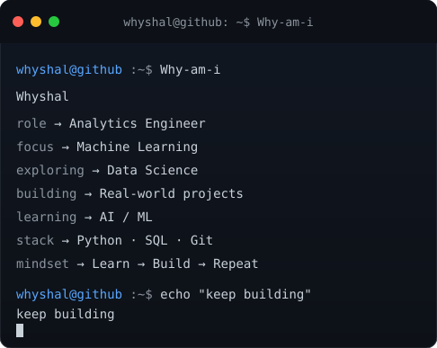

### `Whyshal@github ~ $ Why-am-i`

<table align="center">
  <tr>
    <td align="center" valign="middle">
      
    </td>
    <td align="center" valign="middle">
      
    </td>
  </tr>
</table>

 

 

<h2 align="center">Tech Stack</h2>

  

  
  

 

<h2 align="center">Connect With Me</h2>

  
  &nbsp;&nbsp;
  
  &nbsp;&nbsp;
  

